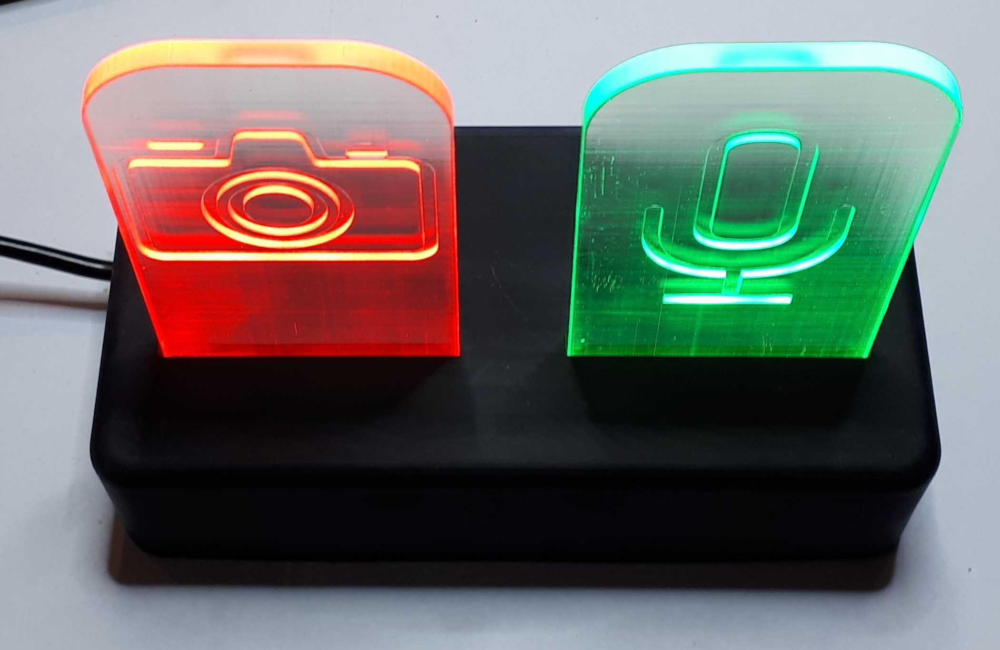

CheckMeet
=========

The warning that you are on a meeting or even your camera is on.

The idea
--------

Working from home can be difficult, the family may not know when we are on a meeting and the camera or microphone is on.
Let’s help them with a sign!

But since you are at your table and they can be in the other room this sign must be there. With the help of WiFi it is not a problem.

The device
----------

Heart of this project is a NodeMCU-ESP8266 board. It connects to your home WiFi and waiting information from your computer.
When your microphone or camera is on it lights up the appropriate LEDs. When your computer is off it will switch off the LEDs, so you can still sleep well during night.

The SW
------

For the communication you need to run a small SW on your computer. It is written in Python and has a notification icon to show that it is running.
Currently you have to check the device IP manually but we have plans to improve that in the future.

Acknowledgment
--------------

Original idea is taken from this project:
https://github.com/tlevis/S.H.I.E.L.D
